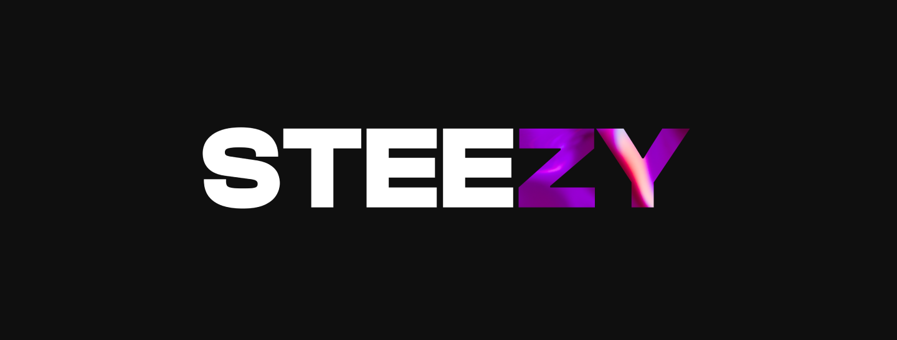

<h2>🔮 About me</h2>
Hi, I am steezy! I build web and mobile apps for everyone. I dove into the coding world back in 2018, and ever since, I've been on a mission to figure out the secret sauce that makes a user experience really pop, and then share that with everyone. I've been part of over 20 commercial projects through the years, and in 2023, I made a switch towards open-source development. It's the best way to learn, meet new people, and have a lot of fun! Come along as I build, learn, and make the code shine!

<h2>🏺 My values</h2>

- **Quality over quantity.** I'm a firm believer in doing fewer things but doing them really well. Quality > quantity is the rule I follow in every aspect of my life.
- **Communication.** I love a good chat. I'm all for staying social and keeping in touch with folks from all sorts of places.
- **Balance.** Coding takes a big part of my life, but I always make room for my hobbies, friends and family. This is how I keep my work rolling smoothly and consistently.

<h2>🧰 Toolbox</h2>

<h2>‍💻 Skills</h2>

<h2>📟 Contact me</h2>
I am open for collaboration! Feel free to DM me if you want to work together or just have a chat 😉
  

<a href="https://twitter.com/steezy_dev" target="_blank"><a/>
<a href="https://t.me/steezydev" target="_blank"><a/>
<a href="mailto:thesteezydev@gmail.com" target="_blank"><a/>
